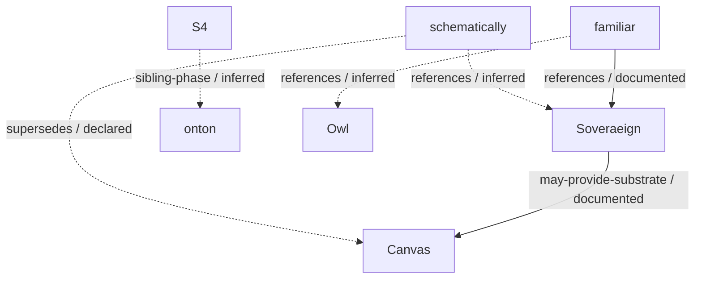

<!-- Generated by lineage/render.py; edit lineage.yaml. -->
# Public repository lineage

Observed 2026-09-05. 29 public repositories. Private repositories are outside this projection.

A source inspection proves that cited bytes exist at a revision. It does not prove the prose is true, that a runtime works, or that a documented integration is implemented. Earlier test observations remain attributed history.

## Relation semantics

`A supersedes B` means A replaced B as an active line. `A may-provide-substrate B` means B documents A as an optional provider. `A references B` records a source citation. `sibling-phase` is a comparison; it does not establish chronology.

The original relation vocabulary remains supported. `may-provide-substrate` preserves optionality; `references` preserves citation without asserting dependency. These extensions were required by the source evidence.



## Evidence for relations

### soveraeign → canvas · may-provide-substrate · documented

Canvas names Soveraeign as an optional provider of grounding, execution, custody, provenance, authority, and evidence.

Limit: This is an intended optional integration, not proof of a running adapter or a core dependency.

- [canvas / README.md](https://github.com/bdf1992/Canvas/blob/157e154241c4bb341625c54b5f9ccd9327d009bd/README.md) — `d059dd84450188fa4fa17d3d857e4ae4551af55c06c7b66912efc2e3be52acc8`
  Source text: Integrations such as Soveraeign may provide stronger grounding

### familiar → soveraeign · references · documented

Familiar names Soveraeign’s typed-contract charting in its reviewed source baselines.

Limit: A source reference does not prove an installed adapter or runtime dependency.

- [familiar / README.md](https://github.com/bdf1992/familiar/blob/cc0e7b75557a1527a16ac458a8612146f08faaa2/README.md) — `ead845674e7bc76e53c940bde8b6f9120866713c5b7b20d83d265d83723be58b`
  Source text: Soveraeign&#x27;s experimental typed-contract charting

### schematically → canvas · supersedes · declared

The previous lineage session records an owner statement that Schematically replaced Canvas.

Limit: The owner statement is reported by that session; no repository integration or API compatibility is established.

- [system-cartographer / lineage/lineage.yaml](https://github.com/bdf1992/system-cartographer/blob/453975f36f4aea30b0de8bad7df218f31aba00f3/lineage/lineage.yaml) — `dd9f9f1f144e3304daf6e55060ff2a1846c9c00e8107a1479f15dc692e18a58c`
  Source text: Stated by the owner, 2026-09-04.

### s4 → onton · sibling-phase · inferred

Both repositories frame experiments around Software 4.0 using the 1.0/2.0/3.0 distinction.

Limit: Shared questions support a comparison, not a proven chronology or explicit repository relationship.

- [s4 / README.md](https://github.com/bdf1992/S4/blob/ddadfb7fd4489e3cd297f2c4ede8d869a65b6dbc/README.md) — `8c368026256c7900243fa4ffc89e9b3efbdd053a41dc54fc4c3daa88df2061f0`
  Source text: 3.0 software is here. 4.0 is not.
- [onton / README.md](https://github.com/bdf1992/onton/blob/a78babae53dbaf609ded91e285268ce2d03c7bf4/README.md) — `8fbe53c0f4dd2c2d9ce9dda345a5b2cae4cb5b7240a05e90f4036cade6a7d5b3`
  Source text: Software 4.0 is software that types its own delivery layer.

### ontum → onton · supersedes · unsupported

Ontum records the retirement of the unit-name Onton.

Limit: A vocabulary rename does not establish that bdf1992/ontum superseded bdf1992/onton. Excluded from graph projections.

- [ontum / docs/phase-2/ontum-evolution.md](https://github.com/bdf1992/ontum/blob/43b8ac3839214e24f3667ce99443dbc537b5e5c0/docs/phase-2/ontum-evolution.md) — `02516e8f9f89a645d065eec7f386329cd21902e91dec6e330225c799bc496130`
  Source text: **Onton** **[DEAD]** — the original unit-name

### schematically → soveraeign · references · inferred

Schematically stores documents under the soveraeign.schematic namespace.

Limit: A shared namespace alone does not prove that the Soveraeign repository owns the format or is hosted by the editor.

- [schematically / DATA-FORMATS.md](https://github.com/bdf1992/schematically/blob/5622888813a07fcc83868028b47fc9017302da77/DATA-FORMATS.md) — `82cc4a3603f1ffca57bc6961176c6b043859b4fdf2709b45e04a393c68f82dd9`
  Source text: soveraeign.schematic/document@0.1

### familiar → owl · references · inferred

Familiar’s find-familiar example names an Owl Agent and owl.system.

Limit: The named agent role is not enough to prove use of the bdf1992/Owl repository.

- [familiar / cast/examples/find-familiar/SPELL.md](https://github.com/bdf1992/familiar/blob/cc0e7b75557a1527a16ac458a8612146f08faaa2/cast/examples/find-familiar/SPELL.md) — `78ae34e10a9d26bde1e1b89352803644b6be8772743b11a9657fc6f56c52e3d2`
  Source text: The Owl Agent may conduct the cast using `owl.system` as its Familiar.

## Repository observations

### [Soveraeign](https://github.com/bdf1992/Soveraeign)

People and AI models work through the same records, permissions and history.

Source: [4b0bc1d7:README.md](https://github.com/bdf1992/Soveraeign/blob/4b0bc1d7e3a92f2671d86bc6467f57f2dd62d51b/README.md). Observed 2026-09-05.

```sh
python lineage/verify_sources.py --remote --node soveraeign
```

Pinned source blob 4cc02d88b10fcac2e9f9a150aa019c2d23979965; SHA256 and cited text verified

A documented citation or optional-provider relation is recorded; no working runtime dependency is inferred.

Earlier report (2026-09-04): `python scripts/verify.py` → 50 checks, exit 0. Previous session; not rerun in this pass; source revision was not recorded.

### [ontum](https://github.com/bdf1992/ontum)

A governed gateway for autonomous AI work, where the append-only log is the truth and every other view is folded from it.

Source: [43b8ac38:README.md](https://github.com/bdf1992/ontum/blob/43b8ac3839214e24f3667ce99443dbc537b5e5c0/README.md). Observed 2026-09-05.

```sh
python lineage/verify_sources.py --remote --node ontum
```

Pinned source blob aef1c9636995b81518431701c1439eac14b742c7; SHA256 and cited text verified

No repository-to-repository relationship was substantiated in this bounded source inspection.

Earlier report (2026-09-04): `python -m unittest discover -s tests` → 1612 tests, 2 skipped, OK. Previous session; not rerun in this pass; source revision was not recorded.

### [onton](https://github.com/bdf1992/onton)

Types how a generated artifact was formed, so trust carries across human, machine and composed work.

Source: [a78babae:README.md](https://github.com/bdf1992/onton/blob/a78babae53dbaf609ded91e285268ce2d03c7bf4/README.md). Observed 2026-09-05.

```sh
python lineage/verify_sources.py --remote --node onton
```

Pinned source blob 1f8e338a1ef19c9fb06a3c8a05be61546eacb758; SHA256 and cited text verified

No repository-to-repository relationship was substantiated in this bounded source inspection.

Earlier report (2026-09-04): `python -m pytest -q` → 1915 passed, 5 skipped. Previous session; not rerun in this pass; source revision was not recorded.

### [schematically](https://github.com/bdf1992/schematically)

A schematic editor whose document is a semantic model of components, parts and wires rather than a drawing.

Source: [56228888:README.md](https://github.com/bdf1992/schematically/blob/5622888813a07fcc83868028b47fc9017302da77/README.md). Observed 2026-09-05.

```sh
python lineage/verify_sources.py --remote --node schematically
```

Pinned source blob b6e51c261b2df4237f9b42743f80a7058e6c2487; SHA256 and cited text verified

No repository-to-repository relationship was substantiated in this bounded source inspection.

Earlier report (2026-09-04): `python scripts/qa.py` → exit 0, 37 suites + 17 JS syntax checks, 14 mutants killed 0 survived. Previous session; not rerun in this pass; source revision was not recorded.

### [Canvas](https://github.com/bdf1992/Canvas)

Arranges addressable things in space, relates them visibly, and wires a subset into executable circuits.

Source: [157e1542:README.md](https://github.com/bdf1992/Canvas/blob/157e154241c4bb341625c54b5f9ccd9327d009bd/README.md). Observed 2026-09-05.

```sh
python lineage/verify_sources.py --remote --node canvas
```

Pinned source blob fa2765fbe659b3a04b43292e3c6e3eb203e57789; SHA256 and cited text verified

Prior owner declaration reported in the lineage commit; distinct from GitHub archival state.

A documented citation or optional-provider relation is recorded; no working runtime dependency is inferred.

Earlier report (2026-09-04): `python -m pytest -q` → 30 passed. Previous session; not rerun in this pass; source revision was not recorded.

### [familiar](https://github.com/bdf1992/familiar)

A local-first experimental workbench for portable agent guidance and evidence-backed skill evolution.

Source: [cc0e7b75:README.md](https://github.com/bdf1992/familiar/blob/cc0e7b75557a1527a16ac458a8612146f08faaa2/README.md). Observed 2026-09-05.

```sh
python lineage/verify_sources.py --remote --node familiar
```

Pinned source blob 81a2678760a1e81fa93233bf0c78714e729689ca; SHA256 and cited text verified

A documented citation or optional-provider relation is recorded; no working runtime dependency is inferred.

Earlier report (2026-09-04): `python -m pytest -q` → 463 passed, 86 subtests passed. Previous session; not rerun in this pass; source revision was not recorded.

### [Owl](https://github.com/bdf1992/Owl)

Turns a rough request or exploratory mark into a complete, inspectable result, then redraws that same target from feedback without drifting into another project.

Source: [58dcc1cf:README.md](https://github.com/bdf1992/Owl/blob/58dcc1cf77d52a4b7579408e806e0f69aa292d98/README.md). Observed 2026-09-05.

```sh
python lineage/verify_sources.py --remote --node owl
```

Pinned source blob da75fc7de7794f5e4e44f9b70bcd84ec630df414; SHA256 and cited text verified

No repository-to-repository relationship was substantiated in this bounded source inspection.

Earlier report (2026-09-04): `cd draw-the-owl && python -m pytest -q` → 38 passed, 12 subtests passed. Previous session; not rerun in this pass; source revision was not recorded.

### [HowDo](https://github.com/bdf1992/HowDo)

A discipline for understanding a problem before acting on it.

Source: [f2526577:README.md](https://github.com/bdf1992/HowDo/blob/f25265770d47ff9733b4ca54fe2b1691cf79153b/README.md). Observed 2026-09-05.

```sh
python lineage/verify_sources.py --remote --node howdo
```

Pinned source blob 38dd101f641d231ae6a4cc6213e46fe4695090f6; SHA256 and cited text verified

No repository-to-repository relationship was substantiated in this bounded source inspection.

Earlier report (2026-09-04): `python -m pytest -q` → 591 passed, 273 subtests passed. Previous session; not rerun in this pass; source revision was not recorded.

### [S4](https://github.com/bdf1992/S4)

Tests whether the two-axis split between programs and protocols survives being handed to a fresh agent.

Source: [ddadfb7f:README.md](https://github.com/bdf1992/S4/blob/ddadfb7fd4489e3cd297f2c4ede8d869a65b6dbc/README.md). Observed 2026-09-05.

```sh
python lineage/verify_sources.py --remote --node s4
```

Pinned source blob 8dd9bd171a16b7e558bb34ec77a1ee66fdf87230; SHA256 and cited text verified

No repository-to-repository relationship was substantiated in this bounded source inspection.

Earlier report (2026-09-04): `PYTHONPATH=. python boards/collectors/test_factory_install_drift.py` → exit 0, factory install_drift 5/5 cases pass. Previous session; not rerun in this pass; source revision was not recorded.

### [DDD-CCC](https://github.com/bdf1992/DDD-CCC)

A typed measurement framework that records claims about repositories and checks declared module proofs.

Source: [94877896:README.md](https://github.com/bdf1992/DDD-CCC/blob/94877896d1df4a856aca8377d8f515d880f1b78e/README.md). Observed 2026-09-05.

```sh
python lineage/verify_sources.py --remote --node ddd-ccc
```

Pinned source blob 81a264f0185993138bec5cb2fc75686c9d3ede48; SHA256 and cited text verified

No repository-to-repository relationship was substantiated in this bounded source inspection.

Earlier report (2026-09-04): `python -m s3.cubes.run_proofs` → 4 green, 0 fail, acceptance met. Previous session; not rerun in this pass; source revision was not recorded.

### [context](https://github.com/bdf1992/context)

A single-file harness that installs into any directory and gives an agent a bounded world to work in.

Source: [6433b88c:README.md](https://github.com/bdf1992/context/blob/6433b88c1ba25ffb5763fc878ea43ced1769eeea/README.md). Observed 2026-09-05.

```sh
python lineage/verify_sources.py --remote --node context
```

Pinned source blob d38b17586e81823dfc5d5e0728a2a2a629188cb5; SHA256 and cited text verified

No repository-to-repository relationship was substantiated in this bounded source inspection.

Earlier report (2026-09-04): `none — no test suite, by design` → not applicable. Previous session; not rerun in this pass; source revision was not recorded.

### [evident](https://github.com/bdf1992/evident)

A session-based instrument for bootstrapping how an organization works, in about thirty minutes.

Source: [7db33ec8:README.md](https://github.com/bdf1992/evident/blob/7db33ec8f12d33c0e32e3c414ba62656e259b2d5/README.md). Observed 2026-09-05.

```sh
python lineage/verify_sources.py --remote --node evident
```

Pinned source blob 84f232017fbb573ef4ef296056b2eb7aa28ab4b3; SHA256 and cited text verified

No repository-to-repository relationship was substantiated in this bounded source inspection.

Earlier report (2026-09-04): `python -m pytest -q` → 1 passed. Previous session; not rerun in this pass; source revision was not recorded.

### [system-cartographer](https://github.com/bdf1992/system-cartographer)

A Claude Code skill that reverse-engineers an undocumented agent or AI-native system into a description complete enough to rebuild it.

Source: [453975f3:README.md](https://github.com/bdf1992/system-cartographer/blob/453975f36f4aea30b0de8bad7df218f31aba00f3/README.md). Observed 2026-09-05.

```sh
python lineage/verify_sources.py --remote --node system-cartographer
```

Pinned source blob a1fc3af3ef3c833d16b6c954d02b2abedcca8dae; SHA256 and cited text verified

No repository-to-repository relationship was substantiated in this bounded source inspection.

Earlier report (2026-09-04): `none — no test suite, by design` → not applicable. Previous session; not rerun in this pass; source revision was not recorded.

### [small-world](https://github.com/bdf1992/small-world)

A bounded lab for generative-world architecture, built for Catalyst Core.

Source: [85e83324:README.md](https://github.com/bdf1992/small-world/blob/85e83324b2e5118419d4faaaff2f49772761ff58/README.md). Observed 2026-09-05.

```sh
python lineage/verify_sources.py --remote --node small-world
```

Pinned source blob 2f716b3d3ba5dc3eba3f84205b4ce631824ae6db; SHA256 and cited text verified

No repository-to-repository relationship was substantiated in this bounded source inspection.

Earlier report (2026-09-04): `npm test` → 9 suites, exit 0. Previous session; not rerun in this pass; source revision was not recorded.

### [ide](https://github.com/bdf1992/ide)

A small in-chat editor that opens in a side panel and reuses proven browser components.

Source: [71216cdd:README.md](https://github.com/bdf1992/ide/blob/71216cdd6b71605b09f5b9cbae70942a923524bf/README.md). Observed 2026-09-05.

```sh
python lineage/verify_sources.py --remote --node ide
```

Pinned source blob f3f50ddc4fdbc70fb9a1642696db7be559a221d5; SHA256 and cited text verified

No repository-to-repository relationship was substantiated in this bounded source inspection.

Earlier report (2026-09-04): `cd poc/neural-elaboration && python -m pytest -q` → 17 passed. Previous session; not rerun in this pass; source revision was not recorded.

### [nostalgia](https://github.com/bdf1992/nostalgia)

An agent-assisted helper for getting classic games running and playable with others.

Source: [2b1fd4f9:README.md](https://github.com/bdf1992/nostalgia/blob/2b1fd4f9fb3e3446a0521069039e1f4dbeb02985/README.md). Observed 2026-09-05.

```sh
python lineage/verify_sources.py --remote --node nostalgia
```

Pinned source blob 621db1fccc2907ffd5ec3f301110b317a017bcf8; SHA256 and cited text verified

No repository-to-repository relationship was substantiated in this bounded source inspection.

Earlier report (2026-09-04): `none — no test suite` → not applicable. Previous session; not rerun in this pass; source revision was not recorded.

### [holon](https://github.com/bdf1992/holon)

A research notebook exploring generative distinctions, structure, and form.

Source: [238e0348:README.md](https://github.com/bdf1992/holon/blob/238e0348d8030db36eba38418d2705284d07e6ff/README.md). Observed 2026-09-05.

```sh
python lineage/verify_sources.py --remote --node holon
```

Pinned source blob 77194f3914348102300107605026bd784c2aa85b; SHA256 and cited text verified

Prior owner declaration reported in the lineage commit; distinct from GitHub archival state.

No repository-to-repository relationship was substantiated in this bounded source inspection.

Earlier report (2026-09-04): `none — no test suite, no entry point` → 1358 markdown documents, 24 commits, last worked 2025-11-30. Previous session; not rerun in this pass; source revision was not recorded.

### [Agentic](https://github.com/bdf1992/Agentic)

Spawned and scheduled real Claude Code sessions from a dashboard, each configured for a role.

Source: [15a696a7:README.md](https://github.com/bdf1992/Agentic/blob/15a696a7869d9dbcb72332106ab2a742141c4689/README.md). Observed 2026-09-05.

```sh
python lineage/verify_sources.py --remote --node agentic
```

Pinned source blob 500f8b0f31d37681922f13e497447b35ffa5d063; SHA256 and cited text verified

No repository-to-repository relationship was substantiated in this bounded source inspection.

Earlier report (2026-09-04): `python -m pytest -q` → not runnable here — 2 collection errors, missing service dependencies. Previous session; not rerun in this pass; source revision was not recorded.

### [LangWorld](https://github.com/bdf1992/LangWorld)

A copy of the LangChain ReAct agent template, retained as a reference.

Source: [525bea41:README.md](https://github.com/bdf1992/LangWorld/blob/525bea410dbaee5d2e4806a2abb922559e83c8cc/README.md). Observed 2026-09-05.

```sh
python lineage/verify_sources.py --remote --node langworld
```

Pinned source blob ad089aed59143e001283f33ec43fa227cfe24a2f; SHA256 and cited text verified

No repository-to-repository relationship was substantiated in this bounded source inspection.

Earlier report (2026-09-04): `git log --oneline` → 1 commit, LICENSE is MIT (c) 2024 LangChain. Previous session; not rerun in this pass; source revision was not recorded.

### [baseless](https://github.com/bdf1992/baseless)

A reserved repository name with a placeholder README and license.

Source: [25c3bd66:README.md](https://github.com/bdf1992/baseless/blob/25c3bd6691207d4f4d9208f421455c51a0960a4a/README.md). Observed 2026-09-05.

```sh
python lineage/verify_sources.py --remote --node baseless
```

Pinned source blob fe6c46d226f4ec71156447f3bbce25408f5b03ef; SHA256 and cited text verified

No repository-to-repository relationship was substantiated in this bounded source inspection.

Earlier report (2026-09-04): `git log --oneline` → no history until a README stating it is empty was added 2026-09-04. Previous session; not rerun in this pass; source revision was not recorded.

### [Diedle](https://github.com/bdf1992/Diedle)

An idle dice game implemented in Unity on the Omega mathematical model.

Source: [cf463b43:README.md](https://github.com/bdf1992/Diedle/blob/cf463b438fd7044ed4ed203f3a4c95f3c6715738/README.md). Observed 2026-09-05.

```sh
python lineage/verify_sources.py --remote --node diedle
```

Pinned source blob f722c1e3b2e01a1a41a4ad4047820362fe31e1e5; SHA256 and cited text verified

Upstream: [Fatihprlg/UnityProjectBase](https://github.com/Fatihprlg/UnityProjectBase).

Upstream reference or fork; no dependency from the authored projects was substantiated.

### [field](https://github.com/bdf1992/field)

A reference fork of Microsoft Code - OSS.

Source: [e78b7df2:README.md](https://github.com/bdf1992/field/blob/e78b7df27dcc7a796e47054d0d53ee2416c9266a/README.md). Observed 2026-09-05.

```sh
python lineage/verify_sources.py --remote --node field
```

Pinned source blob 9ef3a879555c3c2275039222f907e333e033738e; SHA256 and cited text verified

Upstream: [microsoft/vscode](https://github.com/microsoft/vscode).

Upstream reference or fork; no dependency from the authored projects was substantiated.

### [Clouds](https://github.com/bdf1992/Clouds)

A reference fork of a Unity cloud raymarching experiment.

Source: [fcc997c4:README.md](https://github.com/bdf1992/Clouds/blob/fcc997c40d36c7bedf95a294cd2136b8c5127009/README.md). Observed 2026-09-05.

```sh
python lineage/verify_sources.py --remote --node clouds
```

Pinned source blob 41923997396509ee3b8f0d93d5ed95190e2d1f24; SHA256 and cited text verified

Upstream: [SebLague/Clouds](https://github.com/SebLague/Clouds).

Upstream reference or fork; no dependency from the authored projects was substantiated.

### [digitaldimensions](https://github.com/bdf1992/digitaldimensions)

A reference fork containing a browser dimensional incremental game.

Source: [fef3ce17:index.html](https://github.com/bdf1992/digitaldimensions/blob/fef3ce173acd97647a059ef4555ba55879f88b3c/index.html). Observed 2026-09-05.

```sh
python lineage/verify_sources.py --remote --node digitaldimensions
```

Pinned source blob d16c92984374a9868ead55be1f7360ac4367e450; SHA256 and cited text verified

Upstream: [MaxRobinsonTheGreat/hyperdimensions](https://github.com/MaxRobinsonTheGreat/hyperdimensions).

Upstream reference or fork; no dependency from the authored projects was substantiated.

### [Slime-Simulation](https://github.com/bdf1992/Slime-Simulation)

A reference fork of a Unity slime simulation.

Source: [6794cfdf:README.md](https://github.com/bdf1992/Slime-Simulation/blob/6794cfdf584f71c657bd16366e31bf422be99ee6/README.md). Observed 2026-09-05.

```sh
python lineage/verify_sources.py --remote --node slime-simulation
```

Pinned source blob 261e9555c1303c6dd34857e951a3df2c727a408a; SHA256 and cited text verified

Upstream: [SebLague/Slime-Simulation](https://github.com/SebLague/Slime-Simulation).

Upstream reference or fork; no dependency from the authored projects was substantiated.

### [Fluid-Sim](https://github.com/bdf1992/Fluid-Sim)

A reference fork of a Unity fluid simulation.

Source: [4717b725:README.md](https://github.com/bdf1992/Fluid-Sim/blob/4717b7259718d349b0001c82836f24ce5fec81d7/README.md). Observed 2026-09-05.

```sh
python lineage/verify_sources.py --remote --node fluid-sim
```

Pinned source blob e9b33bd6e34aac9109d81a75f82f9aab5643c78c; SHA256 and cited text verified

Upstream: [SebLague/Fluid-Sim](https://github.com/SebLague/Fluid-Sim).

Upstream reference or fork; no dependency from the authored projects was substantiated.

### [StableIndexVector](https://github.com/bdf1992/StableIndexVector)

A reference fork of a C++ vector container with stable element identifiers.

Source: [59bbb4e1:README.md](https://github.com/bdf1992/StableIndexVector/blob/59bbb4e1b9236ed6dbe6320f8ab3a64b6ee9b884/README.md). Observed 2026-09-05.

```sh
python lineage/verify_sources.py --remote --node stableindexvector
```

Pinned source blob 40bfd88ce63a93d309a085b720d86052b836758a; SHA256 and cited text verified

Upstream: [johnBuffer/StableIndexVector](https://github.com/johnBuffer/StableIndexVector).

Upstream reference or fork; no dependency from the authored projects was substantiated.

### [AntSimulator](https://github.com/bdf1992/AntSimulator)

A reference fork of a C++ ant simulation.

Source: [57255f5b:README.md](https://github.com/bdf1992/AntSimulator/blob/57255f5bf0eb361a92d582b4cdf4fa8b96343d61/README.md). Observed 2026-09-05.

```sh
python lineage/verify_sources.py --remote --node antsimulator
```

Pinned source blob 1fe067aeb829e40fcba32fb63812d8c018080048; SHA256 and cited text verified

Upstream: [johnBuffer/AntSimulator](https://github.com/johnBuffer/AntSimulator).

Upstream reference or fork; no dependency from the authored projects was substantiated.

### [Drew-s-Campfire-Videos](https://github.com/bdf1992/Drew-s-Campfire-Videos)

A reference fork of Manim and Blender animation source for Drew’s Campfire.

Source: [35f4c72e:README.md](https://github.com/bdf1992/Drew-s-Campfire-Videos/blob/35f4c72e4b5a8990783375473e975340df9d1e76/README.md). Observed 2026-09-05.

```sh
python lineage/verify_sources.py --remote --node drew-s-campfire-videos
```

Pinned source blob 4fd213d089d335c2d4621aa33dfd73cee44b6888; SHA256 and cited text verified

Upstream: [drewscampfire/Drew-s-Campfire-Videos](https://github.com/drewscampfire/Drew-s-Campfire-Videos).

Upstream reference or fork; no dependency from the authored projects was substantiated.

## Unsubstantiated proposals

The inspection did not establish holon → ontum, holon → Soveraeign, Soveraeign → ontum, familiar → HowDo, Agentic → Soveraeign, or small-world → Diedle. Generic instrument capability in DDD-CCC, context, evident, and system-cartographer does not identify a particular repository being instrumented. These are discovery questions, not graph edges.

See [WORK-QUEUE.md](WORK-QUEUE.md) for the bounded continuation.
