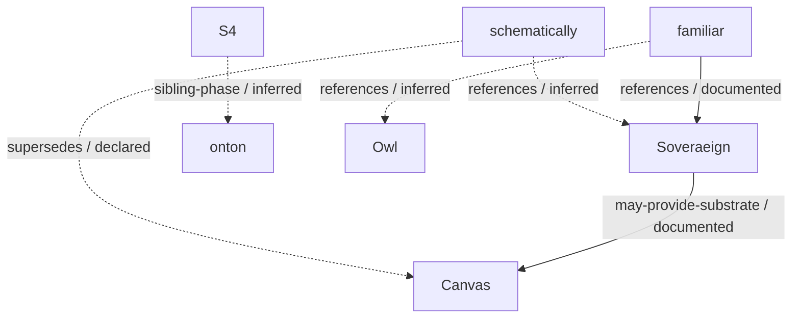

<!-- Generated by lineage/render.py. Edit lineage.yaml or profile-voice.md. -->

# Bdo

I build systems where people and AI can work on the same meaning, inspect how it changed, and see what permits the next action.

The current work approaches that problem through several concrete artifacts: governed records and operations, editable spatial models, verifiable program representations, and bounded generative worlds. The repositories carry different experiments and responsibilities. Their names alone do not establish a dependency.

This page is generated from a public repository lineage. Source checks locate the claims at exact revisions. They do not certify the claims, prove a working integration, or replace each project's own tests.

## Relations



Solid links are documented relations. Dotted links are reported declarations or explicit inferences. Unsupported claims stay in [LINEAGE.md](LINEAGE.md) and are excluded from this graph. Optional provision does not mean a running dependency.

## Records and execution

| Repository | Purpose | State | Source |
| --- | --- | --- | --- |
| [Soveraeign](https://github.com/bdf1992/Soveraeign) | People and AI models work through the same records, permissions and history. | active | [4b0bc1d7:README.md](https://github.com/bdf1992/Soveraeign/blob/4b0bc1d7e3a92f2671d86bc6467f57f2dd62d51b/README.md) |
| [ontum](https://github.com/bdf1992/ontum) | A governed gateway for autonomous AI work, where the append-only log is the truth and every other view is folded from it. | active | [43b8ac38:README.md](https://github.com/bdf1992/ontum/blob/43b8ac3839214e24f3667ce99443dbc537b5e5c0/README.md) |
| [onton](https://github.com/bdf1992/onton) | Types how a generated artifact was formed, so trust carries across human, machine and composed work. | archived; GitHub archived | [a78babae:README.md](https://github.com/bdf1992/onton/blob/a78babae53dbaf609ded91e285268ce2d03c7bf4/README.md) |

## Editing and communication

| Repository | Purpose | State | Source |
| --- | --- | --- | --- |
| [schematically](https://github.com/bdf1992/schematically) | A schematic editor whose document is a semantic model of components, parts and wires rather than a drawing. | active | [56228888:README.md](https://github.com/bdf1992/schematically/blob/5622888813a07fcc83868028b47fc9017302da77/README.md) |
| [Canvas](https://github.com/bdf1992/Canvas) | Arranges addressable things in space, relates them visibly, and wires a subset into executable circuits. | superseded | [157e1542:README.md](https://github.com/bdf1992/Canvas/blob/157e154241c4bb341625c54b5f9ccd9327d009bd/README.md) |
| [ide](https://github.com/bdf1992/ide) | A small in-chat editor that opens in a side panel and reuses proven browser components. | active | [71216cdd:README.md](https://github.com/bdf1992/ide/blob/71216cdd6b71605b09f5b9cbae70942a923524bf/README.md) |

## Inspection and guidance

| Repository | Purpose | State | Source |
| --- | --- | --- | --- |
| [familiar](https://github.com/bdf1992/familiar) | A local-first experimental workbench for portable agent guidance and evidence-backed skill evolution. | active | [cc0e7b75:README.md](https://github.com/bdf1992/familiar/blob/cc0e7b75557a1527a16ac458a8612146f08faaa2/README.md) |
| [DDD-CCC](https://github.com/bdf1992/DDD-CCC) | A typed measurement framework that records claims about repositories and checks declared module proofs. | active | [94877896:README.md](https://github.com/bdf1992/DDD-CCC/blob/94877896d1df4a856aca8377d8f515d880f1b78e/README.md) |
| [context](https://github.com/bdf1992/context) | A single-file harness that installs into any directory and gives an agent a bounded world to work in. | active | [6433b88c:README.md](https://github.com/bdf1992/context/blob/6433b88c1ba25ffb5763fc878ea43ced1769eeea/README.md) |
| [evident](https://github.com/bdf1992/evident) | A session-based instrument for bootstrapping how an organization works, in about thirty minutes. | active | [7db33ec8:README.md](https://github.com/bdf1992/evident/blob/7db33ec8f12d33c0e32e3c414ba62656e259b2d5/README.md) |
| [system-cartographer](https://github.com/bdf1992/system-cartographer) | A Claude Code skill that reverse-engineers an undocumented agent or AI-native system into a description complete enough to rebuild it. | active | [453975f3:README.md](https://github.com/bdf1992/system-cartographer/blob/453975f36f4aea30b0de8bad7df218f31aba00f3/README.md) |
| [nostalgia](https://github.com/bdf1992/nostalgia) | An agent-assisted helper for getting classic games running and playable with others. | active | [2b1fd4f9:README.md](https://github.com/bdf1992/nostalgia/blob/2b1fd4f9fb3e3446a0521069039e1f4dbeb02985/README.md) |

## Working methods

| Repository | Purpose | State | Source |
| --- | --- | --- | --- |
| [Owl](https://github.com/bdf1992/Owl) | Turns a rough request or exploratory mark into a complete, inspectable result, then redraws that same target from feedback without drifting into another project. | active | [58dcc1cf:README.md](https://github.com/bdf1992/Owl/blob/58dcc1cf77d52a4b7579408e806e0f69aa292d98/README.md) |
| [HowDo](https://github.com/bdf1992/HowDo) | A discipline for understanding a problem before acting on it. | active | [f2526577:README.md](https://github.com/bdf1992/HowDo/blob/f25265770d47ff9733b4ca54fe2b1691cf79153b/README.md) |
| [S4](https://github.com/bdf1992/S4) | Tests whether the two-axis split between programs and protocols survives being handed to a fresh agent. | experiment | [ddadfb7f:README.md](https://github.com/bdf1992/S4/blob/ddadfb7fd4489e3cd297f2c4ede8d869a65b6dbc/README.md) |

## Generative worlds

| Repository | Purpose | State | Source |
| --- | --- | --- | --- |
| [small-world](https://github.com/bdf1992/small-world) | A bounded lab for generative-world architecture, built for Catalyst Core. | active | [85e83324:README.md](https://github.com/bdf1992/small-world/blob/85e83324b2e5118419d4faaaff2f49772761ff58/README.md) |
| [Diedle](https://github.com/bdf1992/Diedle) | An idle dice game implemented in Unity on the Omega mathematical model. | experiment; fork | [cf463b43:README.md](https://github.com/bdf1992/Diedle/blob/cf463b438fd7044ed4ed203f3a4c95f3c6715738/README.md) |

## Research and references

| Repository | Purpose | State | Source |
| --- | --- | --- | --- |
| [holon](https://github.com/bdf1992/holon) | A research notebook exploring generative distinctions, structure, and form. | archived | [238e0348:README.md](https://github.com/bdf1992/holon/blob/238e0348d8030db36eba38418d2705284d07e6ff/README.md) |
| [Agentic](https://github.com/bdf1992/Agentic) | Spawned and scheduled real Claude Code sessions from a dashboard, each configured for a role. | archived; GitHub archived | [15a696a7:README.md](https://github.com/bdf1992/Agentic/blob/15a696a7869d9dbcb72332106ab2a742141c4689/README.md) |
| [LangWorld](https://github.com/bdf1992/LangWorld) | A copy of the LangChain ReAct agent template, retained as a reference. | reference | [525bea41:README.md](https://github.com/bdf1992/LangWorld/blob/525bea410dbaee5d2e4806a2abb922559e83c8cc/README.md) |
| [baseless](https://github.com/bdf1992/baseless) | A reserved repository name with a placeholder README and license. | reference | [25c3bd66:README.md](https://github.com/bdf1992/baseless/blob/25c3bd6691207d4f4d9208f421455c51a0960a4a/README.md) |
| [field](https://github.com/bdf1992/field) | A reference fork of Microsoft Code - OSS. | reference; fork | [e78b7df2:README.md](https://github.com/bdf1992/field/blob/e78b7df27dcc7a796e47054d0d53ee2416c9266a/README.md) |
| [Clouds](https://github.com/bdf1992/Clouds) | A reference fork of a Unity cloud raymarching experiment. | reference; fork | [fcc997c4:README.md](https://github.com/bdf1992/Clouds/blob/fcc997c40d36c7bedf95a294cd2136b8c5127009/README.md) |
| [digitaldimensions](https://github.com/bdf1992/digitaldimensions) | A reference fork containing a browser dimensional incremental game. | reference; fork | [fef3ce17:index.html](https://github.com/bdf1992/digitaldimensions/blob/fef3ce173acd97647a059ef4555ba55879f88b3c/index.html) |
| [Slime-Simulation](https://github.com/bdf1992/Slime-Simulation) | A reference fork of a Unity slime simulation. | reference; fork | [6794cfdf:README.md](https://github.com/bdf1992/Slime-Simulation/blob/6794cfdf584f71c657bd16366e31bf422be99ee6/README.md) |
| [Fluid-Sim](https://github.com/bdf1992/Fluid-Sim) | A reference fork of a Unity fluid simulation. | reference; fork | [4717b725:README.md](https://github.com/bdf1992/Fluid-Sim/blob/4717b7259718d349b0001c82836f24ce5fec81d7/README.md) |
| [StableIndexVector](https://github.com/bdf1992/StableIndexVector) | A reference fork of a C++ vector container with stable element identifiers. | reference; fork | [59bbb4e1:README.md](https://github.com/bdf1992/StableIndexVector/blob/59bbb4e1b9236ed6dbe6320f8ab3a64b6ee9b884/README.md) |
| [AntSimulator](https://github.com/bdf1992/AntSimulator) | A reference fork of a C++ ant simulation. | reference; fork | [57255f5b:README.md](https://github.com/bdf1992/AntSimulator/blob/57255f5bf0eb361a92d582b4cdf4fa8b96343d61/README.md) |
| [Drew-s-Campfire-Videos](https://github.com/bdf1992/Drew-s-Campfire-Videos) | A reference fork of Manim and Blender animation source for Drew’s Campfire. | reference; fork | [35f4c72e:README.md](https://github.com/bdf1992/Drew-s-Campfire-Videos/blob/35f4c72e4b5a8990783375473e975340df9d1e76/README.md) |

## Reproduce the record

Run these in the `system-cartographer` checkout containing `lineage/`:

```sh
python -m pip install -r lineage/requirements.txt
python lineage/validate.py
python lineage/verify_sources.py --remote
python lineage/render.py --check
python -m unittest discover -s lineage/tests -v
```

The [full map](LINEAGE.md) contains each observed source command and result, evidence limits, and earlier reported test results. The [Schematically document](lineage.sov) is another generated view of the same record.
